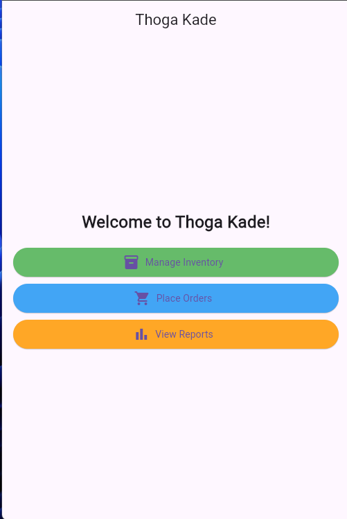

# Thoga Kade Vegetable Shop Management System

Thoga Kade is a robust and modern vegetable shop management system built with Flutter. The app allows users to manage inventory, process orders, and generate daily reports seamlessly. It is designed to provide an efficient and user-friendly experience for shopkeepers.

## Features

1. Inventory Management
- Add, update, view, and delete vegetable stock.
- Categorize vegetables (e.g., leafy, root, fruit).
- Real-time low-stock and expiry alerts.
2. Order Management
- Place customer orders with real-time inventory updates.
- View order history for past transactions.
3. Daily Reports
- Generate sales reports summarizing daily revenue.
- View inventory reports highlighting stock levels and expired items.
4. Modern UI
- Clean and intuitive design using Material Design principles.
- Consistent color schemes and smooth animations.


## Screenshots




## Technologies Used
- Framework: Flutter
- Language: Dart
- State Management: Provider
- Storage: JSON-based file persistence using path_provider

## Setup Instructions
### Prerequisites
- Flutter installed on your machine.
- A compatible IDE (e.g., VS Code or Android Studio).
- Basic knowledge of Flutter and Dart.

1. Clone the Repository:

```bash
  git clone https://github.com/Danidu2000/thoga-kade.git
  cd thoga-kade
```
2. Install Dependencies
```bash
  flutter pub get
```
3. Run the App
```bash
  flutter run
```
## Project Structure
```bash
lib/
├── main.dart                     # Entry point of the application
├── models/                       # Data models
│   ├── vegetable.dart
│   ├── order.dart
│   └── report.dart
├── screens/                      # UI screens
│   ├── home_screen.dart
│   ├── inventory_screen.dart
│   ├── add_vegetable_screen.dart
│   ├── view_inventory_screen.dart
│   ├── order_screen.dart
│   ├── place_order_screen.dart
│   ├── order_history_screen.dart
│   └── report_screen.dart
├── managers/                     # State and business logic
│   ├── inventory_manager.dart
│   ├── order_manager.dart
│   └── report_manager.dart
├── repositories/                 # Data persistence logic
│   ├── inventory_repository.dart
│   ├── order_repository.dart
│   └── report_repository.dart
├── services/                     # Utility services
│   ├── file_service.dart
│   └── report_service.dart
├── utils/                        # Helper utilities
│   ├── validators.dart
│   ├── formatters.dart
│   └── constants.dart

```
## Usage
1. Home Screen
- Navigate to manage inventory, orders, or reports.
2. Inventory Management
- Add Vegetable:
    - Go to Inventory Management > Add Vegetable.
    - Fill in the details and save.
- View Inventory:
    - Go to Inventory Management > View Inventory to see the current stock.
3. Order Management
- Place Order:
    - Go to Order Management > Place Order.
    - Add items and complete the order.
- Order History:
    - View all past orders.
4. Reports
- Navigate to Reports to view sales and inventory details.

## Future Enhancements
- Cloud Sync: Enable syncing inventory and orders to the cloud.
- Barcode Scanning: Add functionality to scan and add items using barcodes.
- Advanced Filtering: Allow filtering orders and inventory by date or category.
- User Accounts: Support multiple user accounts with different roles (admin, cashier).

## Contributing
Contributions are welcome! To contribute:

1. Fork the repository.
2. Create a feature branch:
```bash
  git checkout -b feature-name
```
3. Commit changes and push to your fork:
```bash
  git add .
  git commit -m "Feature: Added new functionality"
  git push origin feature-name
```
4. Create a pull request.

## Contact
For questions or feedback, contact:

- Developer: Danidu Pramuditha
- Email: danidupramuditha2000@gmail.com
- GitHub: https://github.com/Danidu2000